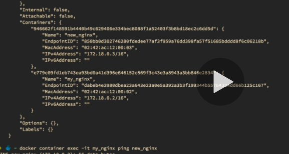

Docker Network
=====

Docker Network: cmds
----
* ` docker inspect --format '{{ .NetworkSettings.IPAddress }}' webhost`

```sh
λ docker network inspect bridge
[
    {
        "Name": "bridge",
        "Id": "f72ac65deaa1f24ec96398514c03fda16fc4a8ccd2f02ce1b2fc05cc9bcf3b5d",
        "Created": "2021-07-21T10:56:59.51548Z",
        "Scope": "local",
        "Driver": "bridge",
        "EnableIPv6": false,
        "IPAM": {
            "Driver": "default",
            "Options": null,
            "Config": [
                {
                    "Subnet": "172.17.0.0/16",
                    "Gateway": "172.17.0.1"
                }
            ]
        },
        "Internal": false,
        "Attachable": false,
        "Ingress": false,
        "ConfigFrom": {
            "Network": ""
        },
        "ConfigOnly": false,
        "Containers": {
            "457ffb149218906db8cccacb377afa1ef9c2cdfb05b0aec6e7c6ab54b945b0c7": {
                "Name": "webhost",
                "EndpointID": "52e0431da820a564cf1a7b07920ac69720ec3e0e7ed3685fa8278d748eb98e48",
                "MacAddress": "02:42:ac:11:00:02",
                "IPv4Address": "172.17.0.2/16",
                "IPv6Address": ""
            }
        },
        "Options": {
            "com.docker.network.bridge.default_bridge": "true",
            "com.docker.network.bridge.enable_icc": "true",
            "com.docker.network.bridge.enable_ip_masquerade": "true",
            "com.docker.network.bridge.host_binding_ipv4": "0.0.0.0",
            "com.docker.network.bridge.name": "docker0",
            "com.docker.network.driver.mtu": "1500"
        },
        "Labels": {}
    }
]
```


* docker network ls
* docker network inspect
* docker network create --driver
* docker network connect
* docker network disconnect


Docker Networks: DNS
----

DNS NAME container name

```
docker network create my_app_net
docker network connect my_app_net nginx01
docker network connect my_app_net nginx02

docker exec -it nginx01 ping nginx02
```

